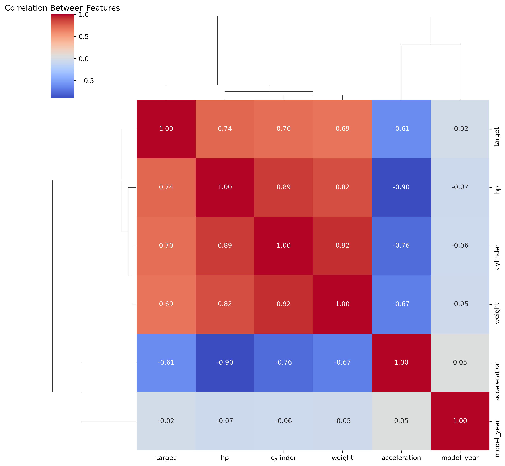
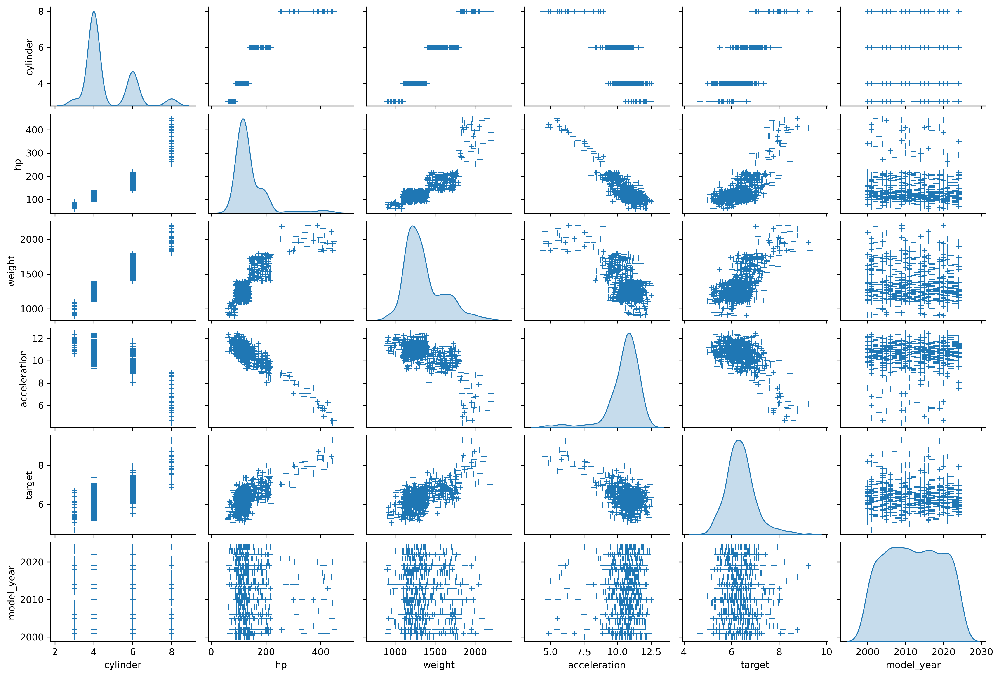
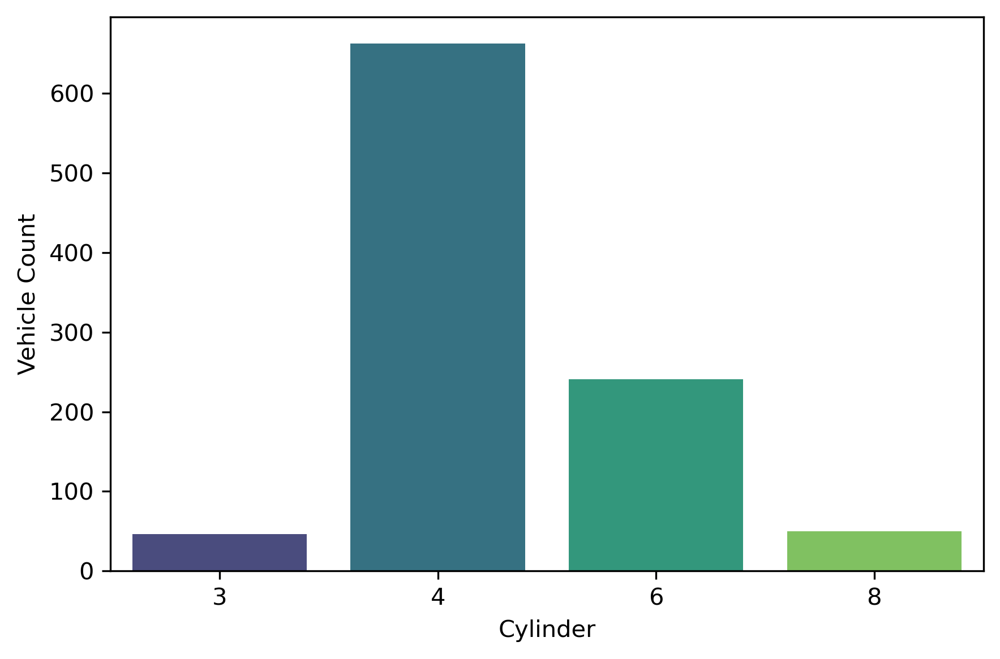
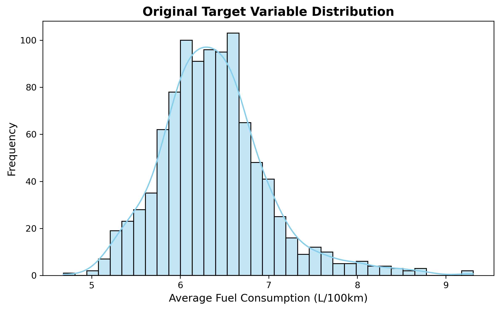
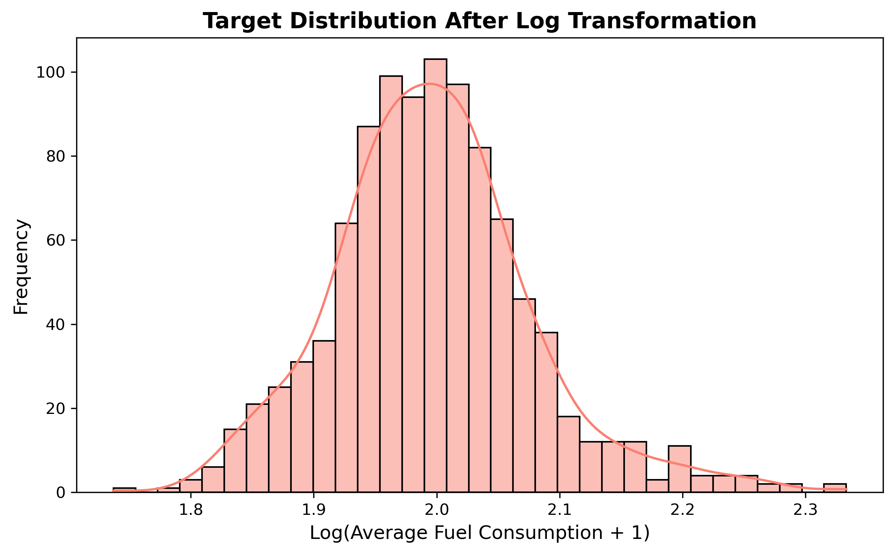
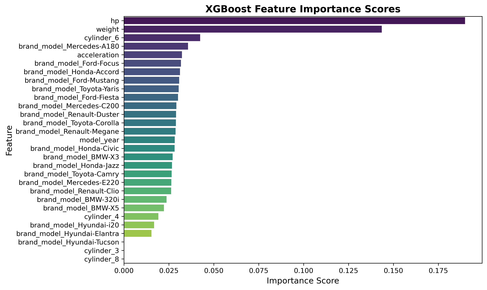

# Vehicle Fuel Consumption Prediction Project

## Project Goal
Predict average fuel consumption based on vehicle specifications.

## Dataset
Dataset contains vehicle features such as cylinder count, horsepower, weight, acceleration, model year, brand-model, and average fuel consumption.

## Data Analysis and Visualization
- Correlation analysis between numeric features.
- Distribution and outlier analysis.
- Target variable normalization using log transformation.
- Feature importance evaluation.

## Modeling Approaches
- Linear Regression
- Ridge Regression with Hyperparameter Tuning
- Lasso Regression with Hyperparameter Tuning
- ElasticNet Regression
- Random Forest Regressor
- XGBoost Regressor with Hyperparameter Tuning

## Performance Metrics
Models are evaluated based on Mean Squared Error (MSE) and R² score.

---

## 📈 Visualizations

### Correlation Matrix  

### Pairplot  

### Cylinder Count Distribution  

### Original Target Distribution  

### Log-Transformed Target Distribution  

### Lasso Regression Cross-Validation Scores  

### XGBoost Feature Importance  

---

## How to Run
1. Load `arac_verileri.csv`.  
2. Run data preprocessing and visualization scripts.  
3. Train models and evaluate performances.  

---

## Notes
- Outlier removal tested but excluded as it decreased performance.  
- Target variable normalized with log transformation to improve model stability.

---

## Contact
Created by [Your Name]  
LinkedIn: [Your LinkedIn URL]  
GitHub: [Your GitHub URL]

### XGBoost Feature Importance  

